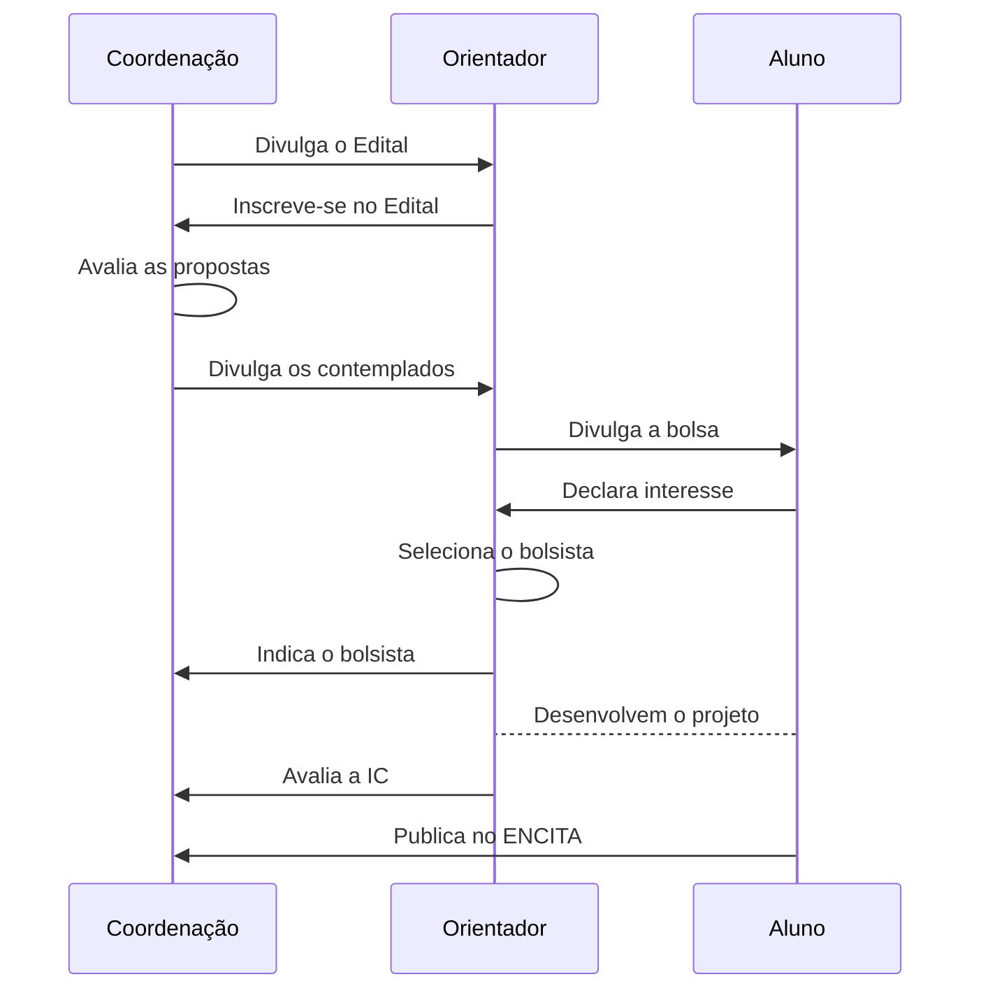

## O que é o programa?

O Programa Institucional de bolsas de Iniciação Científica do CNPq (PIBIC) no
ITA é um programa voltado para o desenvolvimento do pensamento científico
e iniciação à pesquisa de estudantes de graduação do ensino superior.

### Objetivos:

- Contribuir para a formação de recursos humanos para a pesquisa;
- Contribuir para a formação científica de recursos humanos que se dedicarão a qualquer atividade profissional; e
- Contribuir para reduzir o tempo médio de permanência dos alunos na pós-graduação.

O Comitê PIBIC-ITA realiza anualmente um processo de seleção para concessão de
bolsas de iniciação científica para alunos de graduação. Este processo de
seleção está regulamentado em Edital elaborado segundo a Resolução Normativa
017/2006 do CNPq sobre o PIBIC e nas Portarias nº 1.122, de 19.03.2020 e  1.329
de 27.03 de 2020 do MCTIC.

## Fluxo

## Informações para bolsistas 2020/2021

O relatório final deverá seguir o [modelo](/documentos/modelos/relatorio-pibic)
e ser encaminhado até 14/10/2021 com as devidas assinaturas para caic@ita.br.

Sobre ENCITA, devido às restrições impostas pela pandemia de COVID-19, não há
prazo definido para envio do artigo.  Bolsistas e orientadores serão contatados
em breve.

## Informações para bolsistas 2021/2022

Em breve.

## FAQ


  Não, são elegíveis apenas alunos com dedicação exclusiva à pesquisa, sem
  vínculo empregatício e que não usufruam de outras bolsas da mesma natureza.



  Sim, desde que esteja regularmente matriculado na graduação em qualquer outra instituição superior de ensino.

