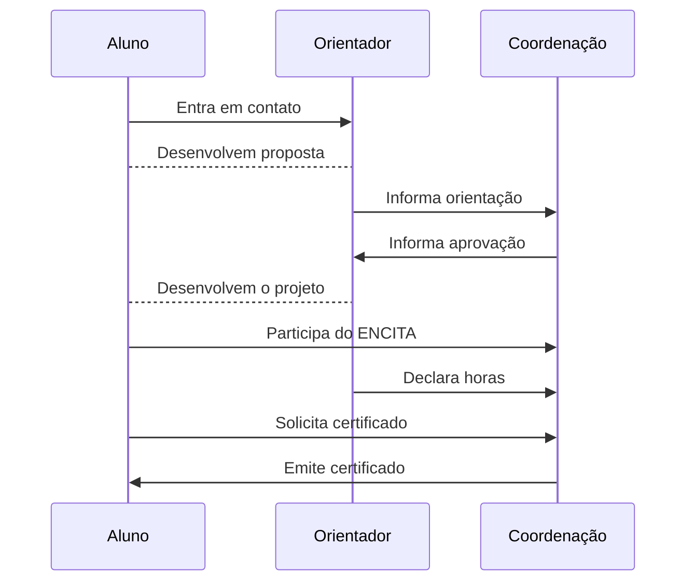

## O que é o programa?

É o programa de Iniciação Científica e Tecnológica para qualquer aluno
regularmente matriculado no ensino superior.  A pesquisa será desenvolvida sob
orientação de um professor do Instituto Tecnológico de Aeronáutica (ITA).

## Fluxo

As inscrições são realizadas em fluxo contínuo.

O processo consiste em:

- Orientador preenche o [formulário online](https://airtable.com/shrJ4ZII0eNNZB4n3);
- A coordenação verifica a documentação e o projeto em reuniões bimestrais;
- Se estiver tudo em ordem, a coordenação entra em contato com o orientador
  indicando a aprovação e início das atividades (com possibilidade de contagem
  retroativa);
- Aluno desenvolve o projeto com supervisão do orientador (entre 1 e 12 meses);
- Ao fim do desenvolvimento, o aluno participa do [ENCITA](/evento);
- O orientador assina uma declaração de horas de trabalho do aluno;
- O aluno solicita emissão da declaração da conclusão da IC com número de horas de
  trabalho para a coordenação.

Mais informações, consulte a [Comunicação Nº 02 ITA/CAIC 2021](/documentos/atas/2021-02.pdf).

## Projetos ativos

<iframe class="airtable-embed" src="https://airtable.com/embed/shrxpwtveorf0LsBF?backgroundColor=orange&layout=card" frameborder="0" onmousewheel="" width="100%" height="533" style="background: transparent; border: 1px solid #ccc;"></iframe>

## FAQ


  Sim, todos os alunos de regularmente matriculados na graduação são elegíveis.
  Se o orientador está em concordância com o tempo de dedicação, não há
  problemas em desempenhar outras atividades.



  Sim, desde que esteja regularmente matriculado na graduação em qualquer outra instituição superior de ensino.



  Os projetos do PICV deverão ter duração de 1 a 12 meses.

