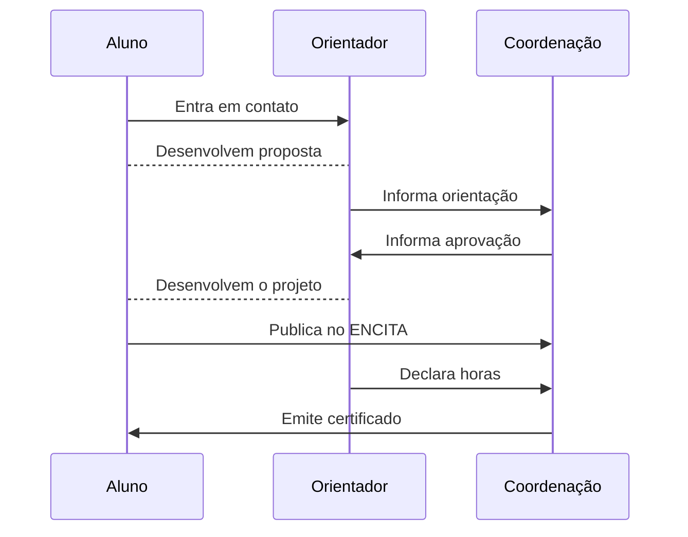

## O que é o programa?

É o programa de Iniciação Científica e Tecnológica para qualquer aluno
regularmente matriculado no ensino superior.  A pesquisa será desenvolvida sob
orientação de um professor do Instituto Tecnológico de Aeronáutica (ITA).

## Fluxo

## Instruções para alunos

## Instruções para orientadores

## FAQ


  Não, são elegíveis apenas alunos com dedicação exclusiva à pesquisa, sem
  vínculo empregatício e que não usufruam de outras bolsas da mesma natureza.



  Sim, desde que esteja regularmente matriculado na graduação em qualquer outra instituição superior de ensino.

